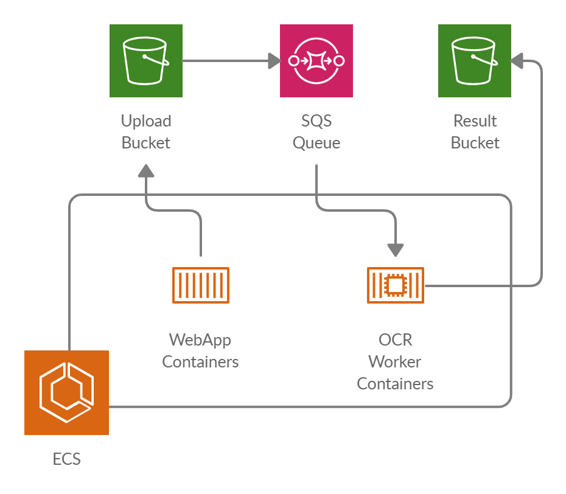

# CloudFormation Templates for an example OCR service with Amazon ECS, SQS, and S3

## Overview

This repository contains CloudFormation templates to delploy an example OCR service on AWS using ECS, SQS and S3

The templates are based on the AWS reference architecture, see https://github.com/aws-samples/ecs-refarch-cloudformation

## Process

Images of scanned or photographed text can be uploaded in the web application. 
The files are transfered to a S3 bucket, which has a bucket notification configured that send as message to a SQS queue.
OCR worker containers poll the queue, recognize text and store the results in another S3 bucket.

## Infrastructure (work in progress)

The repository consists of a set of nested templates that deploy the following:

 - A tiered [VPC](http://docs.aws.amazon.com/AmazonVPC/latest/UserGuide/VPC_Introduction.html) with public and private subnets, spanning an AWS region.
 - A highly available ECS cluster deployed across two [Availability Zones](http://docs.aws.amazon.com/AWSEC2/latest/UserGuide/using-regions-availability-zones.html) in an [Auto Scaling](https://aws.amazon.com/autoscaling/) group and that are AWS SSM enabled.
 - A pair of [NAT gateways](http://docs.aws.amazon.com/AmazonVPC/latest/UserGuide/vpc-nat-gateway.html) (one in each zone) to handle outbound traffic.
 - Two interconnecting microservices deployed as [ECS services](http://docs.aws.amazon.com/AmazonECS/latest/developerguide/ecs_services.html) (website-service and product-service). 
 - An [Application Load Balancer (ALB)](https://aws.amazon.com/elasticloadbalancing/applicationloadbalancer/) to the public subnets to handle inbound traffic.
 - ALB path-based routes for each ECS service to route the inbound traffic to the correct service.
 - Centralized container logging with [Amazon CloudWatch Logs](http://docs.aws.amazon.com/AmazonCloudWatch/latest/logs/WhatIsCloudWatchLogs.html).
 - A [Lambda Function](https://docs.aws.amazon.com/lambda/latest/dg/welcome.html) and [Auto Scaling Lifecycle Hook](https://docs.aws.amazon.com/autoscaling/ec2/userguide/lifecycle-hooks.html) to [drain Tasks from your Container Instances](https://docs.aws.amazon.com/AmazonECS/latest/developerguide/container-instance-draining.html) when an Instance is selected for Termination in your Auto Scaling Group.

## Template details (work in progress)

The templates below are included in this repository and reference architecture:

| Template | Description |
| --- | --- | 
| [master.yaml](master.yaml) | This is the master template - deploy it to CloudFormation and it includes all of the others automatically. |
| [infrastructure/vpc.yaml](infrastructure/vpc.yaml) | This template deploys a VPC with a pair of public and private subnets spread across two Availability Zones. It deploys an [Internet gateway](http://docs.aws.amazon.com/AmazonVPC/latest/UserGuide/VPC_Internet_Gateway.html), with a default route on the public subnets. It deploys a pair of NAT gateways (one in each zone), and default routes for them in the private subnets. |
| [infrastructure/security-groups.yaml](infrastructure/security-groups.yaml) | This template contains the [security groups](http://docs.aws.amazon.com/AmazonVPC/latest/UserGuide/VPC_SecurityGroups.html) required by the entire stack. They are created in a separate nested template, so that they can be referenced by all of the other nested templates. |
| [infrastructure/load-balancers.yaml](infrastructure/load-balancers.yaml) | This template deploys an ALB to the public subnets, which exposes the various ECS services. It is created in in a separate nested template, so that it can be referenced by all of the other nested templates and so that the various ECS services can register with it. |
| [infrastructure/ecs-cluster.yaml](infrastructure/ecs-cluster.yaml) | This template deploys an ECS cluster to the private subnets using an Auto Scaling group and installs the AWS SSM agent with related policy requirements. |
| [infrastructure/lifecyclehook.yaml](infrastructure/lifecyclehook.yaml) | This template deploys a Lambda Function and Auto Scaling Lifecycle Hook to drain Tasks from your Container Instances when an Instance is selected for Termination in your Auto Scaling Group.
| [services/product-service/service.yaml](services/product-service/service.yaml) | This is an example of a long-running ECS service that serves a JSON API of products. For the full source for the service, see [services/product-service/src](services/product-service/src).|
| [services/website-service/service.yaml](services/website-service/service.yaml) | This is an example of a long-running ECS service that needs to connect to another service (product-service) via the load-balanced URL. We use an environment variable to pass the product-service URL to the containers. For the full source for this service, see [services/website-service/src](services/website-service/src). |

### Network

This set of templates deploys the following network design:

| Item | CIDR Range | Usable IPs | Description |
| --- | --- | --- | --- |
| VPC | 10.180.0.0/16 | 65,536 | The whole range used for the VPC and all subnets |
| Public Subnet | 10.180.8.0/21 | 2,041 | The public subnet in the first Availability Zone |
| Public Subnet | 10.180.16.0/21 | 2,041 | The public subnet in the second Availability Zone |
| Private Subnet | 10.180.24.0/21 | 2,041 | The private subnet in the first Availability Zone |
| Private Subnet | 10.180.32.0/21 | 2,041 | The private subnet in the second Availability Zone |